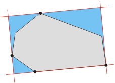

# R-tree Spatial Index

The R-tree (rectangle tree) is a spatial data structure for indexing multi-dimensional objects
(points, rectangles, polygons, etc.).
R-trees group objects in a hierarchy of Minimum Bounding Rectangles (MBR).
This allows the algorithm to quickly discard entire groups of objects during queries.

## Table of Contents

1. [How does it work?](#how-does-it-work)
   - [Glossary](#glossary)
   - [Structure](#structure)
   - [Insertion](#insertion)
   - [Search](#search)
   - [Why is it fast?](#why-is-it-fast)
   - [Why R-tree instead of simple SQL WHERE?](#why-r-tree-instead-of-simple-sql-where)
2. [When to use R-trees](#when-to-use-r-trees)
   - [Viewport queries](#1-viewport-queries-visible-map-area)
   - [Point-in-polygon](#2-point-in-polygon-determine-administrative-boundaries)
   - [Radius queries](#3-radius-query-objects-within-n-meters)
   - [Spatial joins](#4-spatial-join-enrich-points-with-polygon-attributes)
   - [Duplicate detection](#5-detect-duplicate-and-overlapping-polygons)
   - [Road network routing](#6-routing-find-neighboring-nodes-in-a-road-network)
   - [Raster tile aggregation](#7-raster-tile-aggregation-tiles-covering-a-polygon)

## How does it work?

### Glossary

* **MBR (Minimum Bounding Rectangle)** — the smallest axis-aligned rectangle that completely
  encloses a geometric object.

  

    _Source: [Stackoverflow](https://stackoverflow.com/questions/62083411/minimum-bounding-rectangle-of-polygon)_

---

### Structure

The tree has three types of nodes: root, internal nodes, and leaf nodes. Leaf nodes contain
MBRs of actual objects. Each internal node contains an MBR that encloses all its children.
The root contains the MBR of the entire dataset.

---

### Insertion

A new object is inserted top-down. At each level, the node whose MBR requires the least
expansion to fit the new object is chosen. If a leaf becomes full, it splits into two,
and the split can propagate upward.


---

### Search

A query (rectangle or point) is compared against the MBR of each node. If a node's MBR
does not intersect the query, the entire branch is discarded. Only branches whose MBRs
intersect the query are explored.

---

### Why is it fast?

Without an index: **O(n)** — we scan all objects.
With an R-tree: **O(log n + k)** where k is the number of results.
Efficiency depends on how little MBRs of neighboring nodes overlap — less overlap means fewer branches to check.

**_Main weakness_**: when MBRs have significant overlap (e.g., long lines or uniformly distributed
polygons), the tree degrades and the advantage over linear scan decreases.

### Why R-tree instead of simple SQL WHERE?

A table with coordinates requires scanning all rows. An R-tree hierarchically groups objects
into minimum bounding rectangles, so a query prunes entire branches without checking leaf nodes.


## When to use R-trees

### 1. Viewport queries (visible map area)

**Use case**: Find all buildings, roads, or POIs that fall within the visible map area
during pan and zoom operations.

```python
from rtree import index

idx = index.Index()
for i, geom in enumerate(buildings):
    idx.insert(i, geom.bounds)

viewport = (24.01, 49.82, 24.05, 49.84)
candidates = list(idx.intersection(viewport))
# Check only candidates, not all objects
```

---

### 2. Point-in-polygon: determine administrative boundaries

**Use case**: Given GPS coordinates from a track or event, determine which district
or administrative zone contains that point.

```python
from rtree import index
from shapely.geometry import Point

idx = index.Index()
for i, district in enumerate(districts):
    idx.insert(i, district.geometry.bounds)

def find_district(lon, lat, districts, idx):
    pt = Point(lon, lat)
    candidates = idx.intersection((lon, lat, lon, lat))
    for i in candidates:
        if districts[i].geometry.contains(pt):
            return districts[i].name
    return None

find_district(24.032, 49.841, districts, idx)
```

---

### 3. Radius query: objects within N meters

**Use case**: Find all bus stops, cafes, or hospitals within 500 meters of a point.

```python
from rtree import index
from shapely.geometry import Point

idx = index.Index()
for i, stop in enumerate(bus_stops):
    idx.insert(i, stop.geometry.bounds)

def find_within_radius(lon, lat, radius_m, stops, idx):
    # Rough degree estimation for buffer (≈ at Kyiv's latitude)
    deg = radius_m / 111_000
    bbox = (lon - deg, lat - deg, lon + deg, lat + deg)

    candidates = idx.intersection(bbox)
    pt = Point(lon, lat)
    return [
        stops[i] for i in candidates
        if stops[i].geometry.distance(pt) <= deg
    ]

nearby = find_within_radius(24.032, 49.841, 500, bus_stops, idx)
```

---

### 4. Spatial join: enrich points with polygon attributes

**Use case**: Add polygon attributes to points — for example, add the district name
or postal code to each building.

```python
import geopandas as gpd

buildings = gpd.read_file("buildings.gpkg")
postal_zones = gpd.read_file("postal_zones.gpkg")

# sjoin uses STRtree internally
result = gpd.sjoin(
    buildings, postal_zones,
    how="left",
    predicate="within"
)
# result now has postal_code column from the containing polygon
```

---

### 5. Detect duplicate and overlapping polygons

**Use case**: Find overlapping land parcels (cadastral errors) or duplicate buildings
after merging two datasets.

```python
from rtree import index

idx = index.Index()
overlaps = []

for i, geom_a in enumerate(parcels):
    candidates = list(idx.intersection(geom_a.bounds))
    for j in candidates:
        if i != j:
            geom_b = parcels[j]
            if geom_a.intersects(geom_b):
                overlap_area = geom_a.intersection(geom_b).area
                overlaps.append((i, j, overlap_area))
    idx.insert(i, geom_a.bounds)

print(f"Found {len(overlaps)} overlaps")
```

---

### 6. Routing: find neighboring nodes in a road network

**Use case**: During pathfinding (Dijkstra / A*), quickly retrieve road graph nodes
within reachable distance.

```python
from rtree import index

node_idx = index.Index()
for node_id, (lon, lat) in graph.nodes(data=True):
    node_idx.insert(node_id, (lon, lat, lon, lat))

def get_nearby_nodes(lon, lat, radius_deg=0.005):
    bbox = (lon - radius_deg, lat - radius_deg,
            lon + radius_deg, lat + radius_deg)
    return list(node_idx.intersection(bbox))

# Find the start node nearest to user coordinates
start_candidates = get_nearby_nodes(24.032, 49.841)
start_node = min(start_candidates,
                 key=lambda n: graph.nodes[n]["dist_to_query"])
```

---

### 7. Raster tile aggregation: tiles covering a polygon

**Use case**: Determine which map tiles or raster cells need to be loaded to cover
a given polygon — for example, for NDVI analysis over a field.

```python
from rtree import index

tile_idx = index.Index()
for tile in tiles:
    tile_idx.insert(tile.id, tile.bounds)

def get_tiles_for_polygon(polygon, tile_idx, tiles_dict):
    candidates = list(tile_idx.intersection(polygon.bounds))
    return [
        tiles_dict[i] for i in candidates
        if polygon.intersects(tiles_dict[i].geometry)
    ]

field_polygon = parcels[42].geometry
needed_tiles = get_tiles_for_polygon(field_polygon, tile_idx, tiles_dict)
print(f"Load {len(needed_tiles)} tiles")
```


