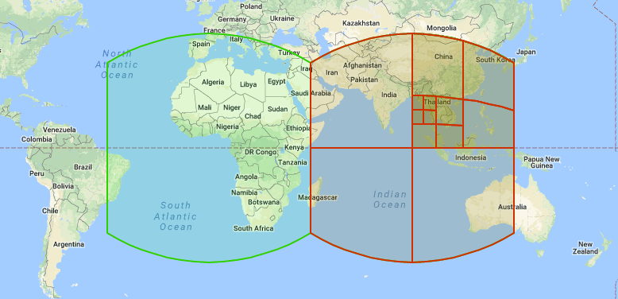
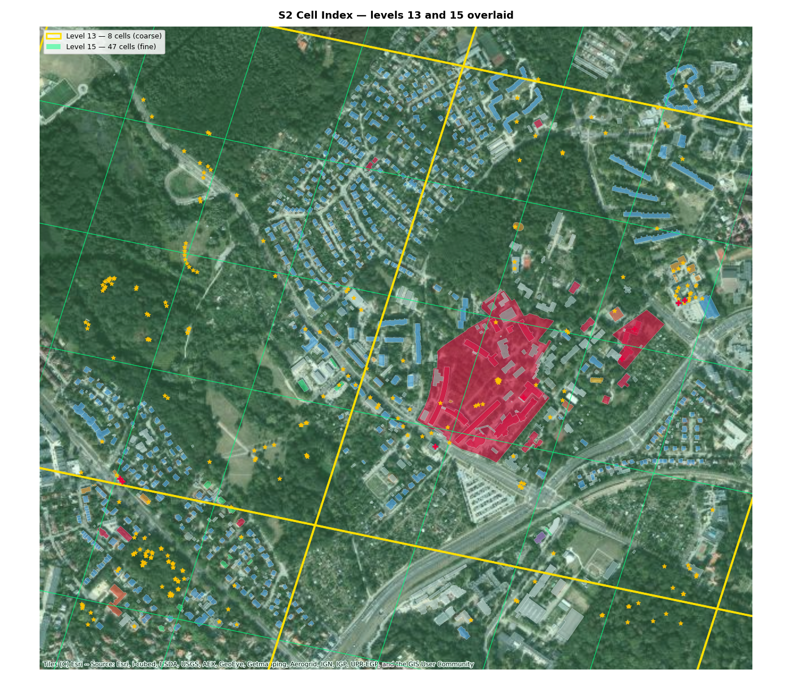
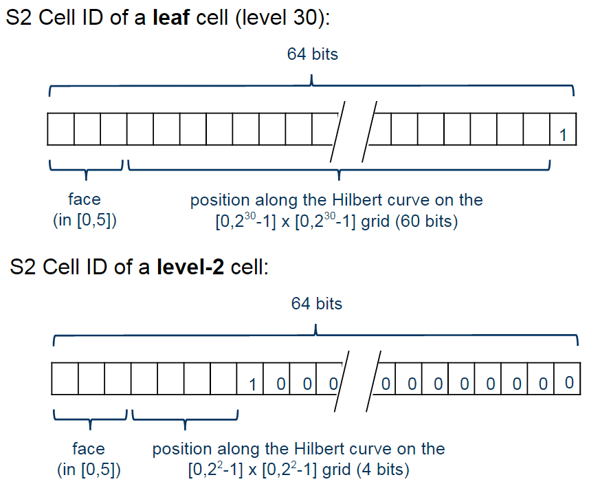
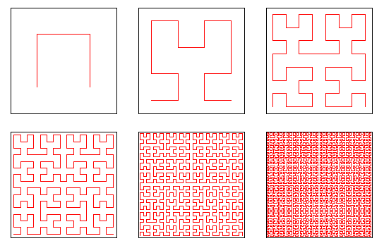

# S2 Spatial Index

The S2 Index (also called S2 Geometry) is a geospatial indexing library from Google that uses
spherical geometry to partition the Earth's surface into a hierarchical grid of cells.
S2 encodes locations as integers, enabling fast spatial queries without complex geometry operations.

## Table of Contents

1. [How does it work?](#how-does-it-work)
   - [Core idea](#core-idea)
   - [Hierarchy of levels](#hierarchy-of-levels)
   - [Cell ID encoding](#cell-id-encoding)
   - [Cell ID encoding (detailed example)](#cell-id-encoding-detailed-example)
   - [Hilbert curve](#hilbert-curve)
2. [Key details](#key-details)
   - [Cube projection is not straightforward](#cube-projection-is-not-straightforward)
   - [Hierarchical containment](#hierarchical-containment)
   - [Covering](#covering)
   - [Comparison with H3 (Uber)](#comparison-with-h3-uber)
3. [When to use S2](#when-to-use-s2)
   - [Geospatial index without PostGIS](#1-geospatial-index-without-postgis)
   - [Viewport/window queries](#2-viewportwindow-queries)
   - [Radius queries](#3-radius-queries)
   - [Sharding/partitioning](#4-shardingpartitioning-of-geodata)
   - [Region joins and aggregations](#5-region-joins-and-aggregations)
4. [Advantages and disadvantages](#advantages-and-disadvantages)
5. [Algorithmic complexity & real-world tuning](#algorithmic-complexity--real-world-tuning)
   - [Theoretical bounds](#theoretical-bounds)
   - [Why theory and practice diverge](#why-theory-and-practice-diverge)
   - [How to improve it in practice](#how-to-improve-it-in-practice)

## How does it work?

### Core idea

Earth is represented as a cube projected onto a sphere. The surface of the cube is divided into
6 faces, each of which is recursively subdivided into 4 smaller cells (squares).



_Source: [s2geometry](https://s2geometry.io)_



---

### Hierarchy of levels

Google projects Earth's surface onto a cube, yielding 6 starting faces (level 0). Each face is
recursively subdivided into 4 squares down to level 30. There are 31 total levels (0–30):

| Level | Cell size | Typical use |
|-------|-----------|------------|
| 0 | ~85 million km² | 1/6 of Earth's surface |
| 5 | ~250 km² | Region / country |
| 10 | ~100 km² | City |
| 13 | ~1 km² | District |
| 20 | ~1,200 m² | City block |
| 30 | ~1 cm² | Centimeter precision |

---

### Cell ID encoding

Each cell is encoded as a single 64-bit integer. The first 3 bits identify the cube face (0–5);
the remaining 61 bits encode the position along the Hilbert curve, ensuring geospatial proximity:
neighboring cells on the map have nearby numeric IDs.

---

### Cell ID encoding (detailed example)



Consider a simplified 8-bit example instead of 64 bits for readability. The structure is the same,
just smaller.

Format: `[1 face bit][2 bits per level][1 marker][padding zeros]`

**Level 0 (largest cell):**

```
face | marker | padding
  1  |   1    | 0 0 0 0 0 0
```

Number = `11000000` = 192. No position bits yet — the marker immediately follows the face.

**Level 1:** Four children. The marker shifts 2 positions right, and 2 position bits appear:

```
face | pos1 | marker | padding
  1  | 0 0  |   1    | 0 0 0
  1  | 0 1  |   1    | 0 0 0
  1  | 1 0  |   1    | 0 0 0
  1  | 1 1  |   1    | 0 0 0
```

(The 8-bit model breaks here — numbers exceed the parent. That's why real S2 uses 64 bits with
3 face bits instead of 1; the ranges work out correctly.)

**On real 64-bit IDs** (simplified):

Face 0, Level 1 child "01":
```
000 | 01 | 1 | 000...0
```

Its Level 2 children:
```
000 | 01 | 00 | 1 | 00...0
000 | 01 | 01 | 1 | 00...0
000 | 01 | 10 | 1 | 00...0
000 | 01 | 11 | 1 | 00...0
```

These four children form a contiguous block. The parent sits at the block's start (when its marker
is replaced with 0 and zeros are appended). All children lie numerically inside that block.

So a query like "give me all objects within cell `000 01 1 000...0`" becomes:

```sql
WHERE cell_id BETWEEN 000_01_00_1_00...0 AND 000_01_11_1_00...0
```

Just two numbers — no geometry at all.

---

### Hilbert curve

The Hilbert curve is a way to visit every cell in a 2D grid exactly once without lifting
the pencil, while preserving spatial proximity: cells that neighbor on the map have neighboring
positions in the traversal.

Start simple. A 2×2 grid has four cells, traversed in a U shape — the first-order Hilbert curve:

```
1 - 2
    |
4 - 3
```

Now take a 4×4 grid, divide it into four 2×2 quadrants. Repeat the U shape in each quadrant,
but rotate or flip some so the end of one quadrant meets the start of the next.
This gives the second-order Hilbert curve.



_Source: [wikipedia](https://pl.wikipedia.org/wiki/Plik:Hilbert_curve.png)_

Repeat once more to get the third-order Hilbert curve for an 8×8 grid, and so on indefinitely.

The key property: cells numbered 7 and 8 are neighbors; cells 12 and 13 are neighbors. There
is no place where the curve makes a large jump across the map. A naive row-major traversal lacks
this property: row 1's end and row 2's start are numerically consecutive but physically opposite corners.

S2 uses the Hilbert curve to number cells within each cube face: if two points on Earth are
geographically close, their Cell IDs are numerically close. Numeric proximity is what enables
efficient neighbor searches via simple range queries in a database.

---

## Key details

### Cube projection is not straightforward

If S2 projected the cube onto the sphere in a naive linear way, cells near the **centers of faces**
would be small, while cells near **edges/corners of faces** would be much larger. This non-uniformity
breaks all estimates like "cell size ≈ level".

Instead, S2 uses a nonlinear **quadratic projection** between cube and sphere that **equalizes cell areas**.
The ratio of the largest to smallest cell at a given level drops from ~5.2 (linear projection) to ~2.1 (quadratic) — cells become nearly uniform in area regardless of position on the face.

```
linear projection              quadratic projection (S2)
edge → LARGE                   edge → almost like center
┌──┬──┬────┬──────┐            ┌───┬───┬───┬────┐
│  │  │    │      │            │   │   │   │    │
├──┼──┼────┼──────┤            ├───┼───┼───┼────┤
│ center│  edge →   │            │   center ≈ edge │
└──┴──┴────┴──────┘            └───┴───┴───┴────┘
   ratio ≈ 5.2x                   ratio ≈ 2.1x
```

---

### Hierarchical containment

This is the foundation of S2's speed. If a level-5 cell has Cell ID `X`, then **all of its children**
at levels 6, 7, …, 30 have Cell IDs in the range:

```
[X,  X + size_of_level5_cell)
```

Children are always numerically "inside" the parent (thanks to the Hilbert curve + marker structure
described above). So `cell.contains(other)` is **not geometry** but a simple comparison:

```python
def contains(parent: int, child: int) -> bool:
    lo, hi = parent_range(parent)      # [X, X + size)
    return lo <= child < hi
```

In SQL, it's a plain `BETWEEN`, **with no trigonometry**:

```sql
SELECT * FROM places
WHERE cell_id BETWEEN :range_min AND :range_max;
```

---

### Covering

To "cover" any geometry (polygon, circle, route) with S2 cells is a trade-off tuned by three parameters:

| Parameter | What it does | Lower value | Higher value |
|-----------|--------------|-------------|--------------|
| `min_level` | coarsest allowed cells | coarser coverage | finer |
| `max_level` | finest allowed cells | coarser, faster | more precise, slower |
| `max_cells` | max cells in covering | faster queries, more FP | more precise, more `OR`/`BETWEEN` |

- **Fewer cells** = shorter SQL, faster queries, but **more false positives** (cells straddle geometry → need exact re-check).
- **More cells** = precise coverage, fewer FP, but **more `BETWEEN` conditions** and slower queries.

In practice, **4–8 cells** per covering is the sweet spot.

```python
import s2sphere as s2

def cover(region: s2.Region, max_cells=8, min_level=4, max_level=16):
    coverer = s2.RegionCoverer()
    coverer.min_level = min_level
    coverer.max_level = max_level
    coverer.max_cells = max_cells              # ← main precision/speed lever
    return coverer.get_covering(region)        # list of S2CellId

# covering a circle with 500 m radius
center = s2.LatLng.from_degrees(49.841, 24.032)
cap = s2.Cap.from_axis_angle(center.to_point(),
                             s2.Angle.from_degrees(500 / 6_371_000 * 57.2958))
cells = cover(cap)
ranges = [(c.range_min().id(), c.range_max().id()) for c in cells]
# then: WHERE cell_id BETWEEN ? AND ?  (OR for each range)
```

---

### Comparison with H3 (Uber)

| Criterion | **S2 (Google)** | **H3 (Uber)** |
|-----------|-----------------|---------------|
| Cell shape | square (cube face → sphere) | hexagon (+ 12 pentagons) |
| Neighbors | 4 edge + 4 corner (different distances) | **6 neighbors equidistant** from center |
| Hierarchy | perfect (4 children, exact nesting) | approximate (7 children, imperfect nesting) |
| Range / `BETWEEN` queries | **native** (Hilbert + containment) | harder |
| Best for | hierarchical queries, DB indexes | routing, neighbor analytics |

In short: **hexagons have all 6 neighbors equidistant** from center — better for **routing** and diffusion.
**S2 is simpler to implement** and **native to hierarchical/range queries** (squares subdivide perfectly into 4 and yield contiguous Cell ID ranges).

---

## When to use S2

### 1. Geospatial index without PostGIS

**Use case**: Need fast spatial queries in SQLite / MySQL / Cassandra where R-tree index is unavailable.
Store `cell_id` as a regular `BIGINT` with a standard B-tree index.

```python
import s2sphere as s2

def cell_for_point(lat, lon, level=15):
    ll = s2.LatLng.from_degrees(lat, lon)
    return s2.CellId.from_lat_lng(ll).parent(level).id()

# on insert
cell_id = cell_for_point(49.841, 24.032)   # INSERT ... (cell_id, ...)

# on read — "what's in this region" = range query
region_cell = s2.CellId.from_token("47a1cb")
lo, hi = region_cell.range_min().id(), region_cell.range_max().id()
# SELECT * FROM places WHERE cell_id BETWEEN :lo AND :hi
```

---

### 2. Viewport/window queries

**Use case**: Cover the visible viewport rectangle with a few S2 cells → generate a set of `BETWEEN` ranges.

```python
rect = s2.LatLngRect(
    s2.LatLng.from_degrees(49.82, 24.01),
    s2.LatLng.from_degrees(49.84, 24.05),
)
cells = cover(rect, max_cells=8)
ranges = [(c.range_min().id(), c.range_max().id()) for c in cells]
# WHERE cell_id BETWEEN ? AND ? OR cell_id BETWEEN ? AND ? ...
```

---

### 3. Radius queries

**Use case**: Find all objects (bus stops, cafes, hospitals) within N meters of a point.

Build an `S2Cap` (spherical circle) and cover it — like the `cover()` example above. Then verify
candidates against the exact distance (haversine).

---

### 4. Sharding/partitioning of geodata

**Use case**: Prefix of Cell ID (face + a few levels) → shard key. Nearby objects land in the same shard
(locality), and range queries don't scatter across all shards.

---

### 5. Region joins and aggregations

**Use case**: Reduce points and polygons to a common cell level → `GROUP BY cell_id` yields heatmaps,
density counts, regional event aggregation without geometry operations.

---

## Advantages and disadvantages

**Advantages**

- ✅ **Spatial queries → integer ranges.** Any DB with a B-tree index becomes geospatial; no PostGIS/R-tree needed.
- ✅ **`contains()` without geometry** — just `BETWEEN` thanks to hierarchical nesting.
- ✅ **Locality** — the Hilbert curve keeps neighbors numerically close (good for cache, sharding, range-scan).
- ✅ **Nearly equal cell areas** thanks to quadratic projection (unlike geohash at high latitudes).
- ✅ **31 levels** — from entire cube face to ~1 cm², precision is tunable.
- ✅ **Compact key** — one 64-bit `int` instead of `(lat, lon)` pair or geometry.

**Disadvantages**

- ❌ **False positives**: covering is coarser than true geometry → need exact re-check on candidates.
- ❌ **Covering requires tuning** (`min/max_level`, `max_cells`) — bad choice = either slow or many FP.
- ❌ **Squares, not hexagons**: neighbors at different distances → worse for routing (H3 wins here).
- ❌ **Objects crossing cell boundaries** get covered by multiple cells (like any grid).
- ❌ Works on **MBR/covering**, not true geometry — complex polygons still need final exact check.

---

## Algorithmic complexity & real-world tuning

### Theoretical bounds

Let `n` = number of indexed objects, `k` = number of query results, `C` = number of cells in covering
(usually `max_cells`, typically 4–8).

| Operation | Complexity | Comment |
|-----------|-----------|---------|
| `point → cell_id` (encoding) | **O(1)** | fixed bit ops + projection |
| `cell.contains(other)` | **O(1)** | one range check, no trig |
| `cell.parent(level)` / `children` | **O(1)** | bit shifts / masks |
| Point lookup in DB (B-tree) | **O(log n)** | standard index lookup |
| Range query (region covering) | **O(C · log n + k)** | `C` range scans + output |
| Building covering (`RegionCoverer`) | **O(C · log(max_cells))** | priority queue on cells |
| Memory per object | **O(1)** | one `int64` (+ your payload) |

Key: expensive trig operations are reduced to **O(1)** bit comparisons, and search is a standard
**B-tree range scan**, not linear **O(n)** scan.

---

### Why theory and practice diverge

- **`O(log n + k)` hides the constant `C` and false positives.** Coarse covering (`max_cells` small)
  → many FP → large effective `k` before filtering, even if true results are few.
- **Each range is a separate index scan.** Many small cells → many `BETWEEN` (`OR`) → DB planner may degrade.
  I/O and range-scan count matter more than asymptotics.
- **Exact re-check costs money.** S2 itself is fast, but final geometry verification (haversine /
  point-in-polygon) on candidates often dominates runtime.

---

### How to improve it in practice

1. **Tune `max_cells` to your workload.** Start at 4–8. Higher for rare precise queries,
   lower for bulk queries — always measure FP/useful ratio.

2. **Merge adjacent ranges.** After `get_covering`, sort `range_min/range_max` and **merge contiguous/overlapping**
   intervals — fewer `BETWEEN` conditions, fewer range scans.

   ```python
   def merge_ranges(ranges):
       ranges.sort()
       merged = [ranges[0]]
       for lo, hi in ranges[1:]:
           if lo <= merged[-1][1] + 1:
               merged[-1] = (merged[-1][0], max(merged[-1][1], hi))
           else:
               merged.append((lo, hi))
       return merged
   ```

3. **Two-phase: filter → refine.** S2 is a fast **filter** for candidates; compute exact geometry
   only on them (they're few).

4. **Store `cell_id` at multiple levels** (e.g., level 10 and 15) or compute on-the-fly:
   coarse for aggregations, fine for precise queries.

5. **Match cell level to typical query size.** If most queries are "city-sized",
   index at level ~10; level 30 just bloats coverage.

6. **Cluster storage by `cell_id`** (clustered index / partitioning). Thanks to Hilbert locality,
   range-scan results lie physically close → less random I/O.

7. **Cache coverings for frequent regions.** Admin boundary / region coverings are stable —
   compute once, store ranges.

8. **For routing / "equidistant neighbors," consider H3 instead** — hexagons give equidistant neighbors;
   keep S2 for hierarchical/range queries.

