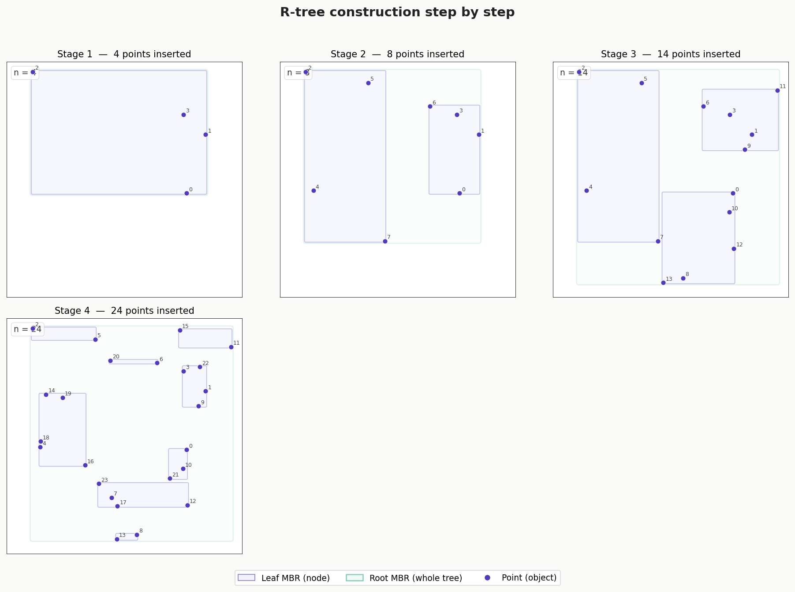

# R-tree Spatial Index

The R-tree (rectangle tree) is a spatial data structure for indexing multi-dimensional objects
(points, rectangles, polygons, etc.).
R-trees group objects in a hierarchy of Minimum Bounding Rectangles (MBR).
This allows the algorithm to quickly discard entire groups of objects during queries.

## Table of Contents

1. [How does it work?](#how-does-it-work)
   - [Glossary](#glossary)
   - [Structure](#structure)
   - [Insertion](#insertion)
   - [Search](#search)
   - [Why is it fast?](#why-is-it-fast)
   - [Why R-tree instead of simple SQL WHERE?](#why-r-tree-instead-of-simple-sql-where)
2. [When to use R-trees](#when-to-use-r-trees)
   - [Viewport queries](#1-viewport-queries-visible-map-area)
   - [Point-in-polygon](#2-point-in-polygon-determine-administrative-boundaries)
   - [Radius queries](#3-radius-query-objects-within-n-meters)
   - [Spatial joins](#4-spatial-join-enrich-points-with-polygon-attributes)
   - [Duplicate detection](#5-detect-duplicate-and-overlapping-polygons)
   - [Road network routing](#6-routing-find-neighboring-nodes-in-a-road-network)
   - [Raster tile aggregation](#7-raster-tile-aggregation-tiles-covering-a-polygon)
3. [R-tree variants](#r-tree-variants)
   - [R*-tree](#r-tree-r-star-tree)
   - [R+-tree](#r-tree-r-plus-tree)
   - [Comparison table](#comparison-table)
4. [Algorithmic complexity & real-world tuning](#algorithmic-complexity--real-world-tuning)
   - [Theoretical bounds](#theoretical-bounds)
   - [Why theory and practice diverge](#why-theory-and-practice-diverge)
   - [How to improve it in practice](#how-to-improve-it-in-practice)

## How does it work?

### Glossary

* **MBR (Minimum Bounding Rectangle)** — the smallest axis-aligned rectangle that completely
  encloses a geometric object.

  

    _Source: [Stackoverflow](https://stackoverflow.com/questions/62083411/minimum-bounding-rectangle-of-polygon)_

---

### Structure

The tree has three types of nodes: root, internal nodes, and leaf nodes. Leaf nodes contain
MBRs of actual objects. Each internal node contains an MBR that encloses all its children.
The root contains the MBR of the entire dataset.

---

### Insertion

A new object is inserted top-down. At each level, the node whose MBR requires the least
expansion to fit the new object is chosen. If a leaf becomes full, it splits into two,
and the split can propagate upward.



---

### Search

A query (rectangle or point) is compared against the MBR of each node. If a node's MBR
does not intersect the query, the entire branch is discarded. Only branches whose MBRs
intersect the query are explored.

---

### Why is it fast?

Without an index: **O(n)** — we scan all objects.
With an R-tree: **O(log n + k)** where k is the number of results.
Efficiency depends on how little MBRs of neighboring nodes overlap — less overlap means fewer branches to check.

**_Main weakness_**: when MBRs have significant overlap (e.g., long lines or uniformly distributed
polygons), the tree degrades and the advantage over linear scan decreases.

### Why R-tree instead of simple SQL WHERE?

A table with coordinates requires scanning all rows. An R-tree hierarchically groups objects
into minimum bounding rectangles, so a query prunes entire branches without checking leaf nodes.


## When to use R-trees

### 1. Viewport queries (visible map area)

**Use case**: Find all buildings, roads, or POIs that fall within the visible map area
during pan and zoom operations.

```python
from rtree import index

idx = index.Index()
for i, geom in enumerate(buildings):
    idx.insert(i, geom.bounds)

viewport = (24.01, 49.82, 24.05, 49.84)
candidates = list(idx.intersection(viewport))
# Check only candidates, not all objects
```

---

### 2. Point-in-polygon: determine administrative boundaries

**Use case**: Given GPS coordinates from a track or event, determine which district
or administrative zone contains that point.

```python
from rtree import index
from shapely.geometry import Point

idx = index.Index()
for i, district in enumerate(districts):
    idx.insert(i, district.geometry.bounds)

def find_district(lon, lat, districts, idx):
    pt = Point(lon, lat)
    candidates = idx.intersection((lon, lat, lon, lat))
    for i in candidates:
        if districts[i].geometry.contains(pt):
            return districts[i].name
    return None

find_district(24.032, 49.841, districts, idx)
```

---

### 3. Radius query: objects within N meters

**Use case**: Find all bus stops, cafes, or hospitals within 500 meters of a point.

```python
from rtree import index
from shapely.geometry import Point

idx = index.Index()
for i, stop in enumerate(bus_stops):
    idx.insert(i, stop.geometry.bounds)

def find_within_radius(lon, lat, radius_m, stops, idx):
    # Rough degree estimation for buffer (≈ at Kyiv's latitude)
    deg = radius_m / 111_000
    bbox = (lon - deg, lat - deg, lon + deg, lat + deg)

    candidates = idx.intersection(bbox)
    pt = Point(lon, lat)
    return [
        stops[i] for i in candidates
        if stops[i].geometry.distance(pt) <= deg
    ]

nearby = find_within_radius(24.032, 49.841, 500, bus_stops, idx)
```

---

### 4. Spatial join: enrich points with polygon attributes

**Use case**: Add polygon attributes to points — for example, add the district name
or postal code to each building.

```python
import geopandas as gpd

buildings = gpd.read_file("buildings.gpkg")
postal_zones = gpd.read_file("postal_zones.gpkg")

# sjoin uses STRtree internally
result = gpd.sjoin(
    buildings, postal_zones,
    how="left",
    predicate="within"
)
# result now has postal_code column from the containing polygon
```

---

### 5. Detect duplicate and overlapping polygons

**Use case**: Find overlapping land parcels (cadastral errors) or duplicate buildings
after merging two datasets.

```python
from rtree import index

idx = index.Index()
overlaps = []

for i, geom_a in enumerate(parcels):
    candidates = list(idx.intersection(geom_a.bounds))
    for j in candidates:
        if i != j:
            geom_b = parcels[j]
            if geom_a.intersects(geom_b):
                overlap_area = geom_a.intersection(geom_b).area
                overlaps.append((i, j, overlap_area))
    idx.insert(i, geom_a.bounds)

print(f"Found {len(overlaps)} overlaps")
```

---

### 6. Routing: find neighboring nodes in a road network

**Use case**: During pathfinding (Dijkstra / A*), quickly retrieve road graph nodes
within reachable distance.

```python
from rtree import index

node_idx = index.Index()
for node_id, (lon, lat) in graph.nodes(data=True):
    node_idx.insert(node_id, (lon, lat, lon, lat))

def get_nearby_nodes(lon, lat, radius_deg=0.005):
    bbox = (lon - radius_deg, lat - radius_deg,
            lon + radius_deg, lat + radius_deg)
    return list(node_idx.intersection(bbox))

# Find the start node nearest to user coordinates
start_candidates = get_nearby_nodes(24.032, 49.841)
start_node = min(start_candidates,
                 key=lambda n: graph.nodes[n]["dist_to_query"])
```

---

### 7. Raster tile aggregation: tiles covering a polygon

**Use case**: Determine which map tiles or raster cells need to be loaded to cover
a given polygon — for example, for NDVI analysis over a field.

```python
from rtree import index

tile_idx = index.Index()
for tile in tiles:
    tile_idx.insert(tile.id, tile.bounds)

def get_tiles_for_polygon(polygon, tile_idx, tiles_dict):
    candidates = list(tile_idx.intersection(polygon.bounds))
    return [
        tiles_dict[i] for i in candidates
        if polygon.intersects(tiles_dict[i].geometry)
    ]

field_polygon = parcels[42].geometry
needed_tiles = get_tiles_for_polygon(field_polygon, tile_idx, tiles_dict)
print(f"Load {len(needed_tiles)} tiles")
```

## R-tree variants

The classic R-tree (Guttman, 1984) leaves one thing unspecified that turns out to dominate
performance: **how to split an overflowing node** and **how to choose the subtree to descend
into**. Different answers to these two questions produce different family members. The two most
important are the **R\*-tree** and the **R+-tree**.

The single metric that ties them together is **overlap** — the total area shared by sibling MBRs.
The more sibling rectangles overlap, the more branches a query must follow, and the closer the
tree drifts back toward an O(n) scan. Every variant below is, fundamentally, a different strategy
for fighting overlap.

```
Classic R-tree                R*-tree                       R+-tree
(MBRs may overlap)            (minimized overlap)           (zero overlap, objects split)

┌───────────┐                ┌─────────┐                   ┌─────┬───────┐
│  ┌────────┼──┐             │ ┌─────┐ │  ┌─────┐          │  A  │   B   │
│  │ A      │B │             │ │  A  │ │  │  B  │          │     │  ┌──┐ │
│  └────────┼──┘             │ └─────┘ │  └─────┘          ├─────┘  │##│ │  ## = object stored
└───────────┘                └─────────┘                   │   C    │##│ │       in BOTH C and B
   overlap = big                overlap ≈ 0                └────────┴──┴─┘
```

---

### R-tree (R\*-tree)

The **R\*-tree** (Beckmann, Kriegel, Schneider, Seeger — 1990) keeps the exact same on-disk
structure as the classic R-tree, but changes the *heuristics*. Any code that reads an R-tree can
read an R\*-tree — only the build/insert logic differs. Three ideas:

1. **Better `ChooseSubtree`.** When inserting at the leaf level, instead of minimizing area
   enlargement, it minimizes the **overlap enlargement** with sibling entries.
2. **Split that minimizes overlap + margin + area**, not just area. It sorts entries along each
   axis and picks the distribution with the smallest perimeter (margin) — "fat" rectangles
   beat long thin ones because they overlap less with future neighbors.
3. **Forced reinsertion.** When a node first overflows, instead of immediately splitting, it
   removes ~30% of the entries (those farthest from the node center) and reinserts them from
   the top. This "self-tuning" effect dramatically improves layout and is the secret sauce.

**Pseudocode — the distinguishing pieces:**

```text
Insert(entry):
    leaf = ChooseSubtree(root, entry)        # overlap-minimizing descent
    add entry to leaf
    if leaf overflows:
        if not yet reinserted at this level:
            ForcedReinsert(leaf)              # pull 30% out, reinsert from root
        else:
            Split(leaf)                       # R*-split: minimize margin, then overlap, then area

ChooseSubtree(node, entry):
    if children are leaves:
        return child minimizing OVERLAP enlargement  # <-- key difference vs classic R-tree
    else:
        return child minimizing AREA enlargement (tie-break: smallest area)

Split(node):
    for each axis (x, y):
        sort entries by lower then by upper edge
        compute margin (perimeter) of all candidate distributions
    choose split AXIS with minimum total margin
    on that axis choose distribution with minimum OVERLAP (tie-break: minimum AREA)
```

**Advantages**

- 10–50% fewer disk accesses on real queries than the classic R-tree — usually the best
  general-purpose dynamic spatial index.
- Forced reinsertion produces a near-optimal layout *incrementally*, without a rebuild.
- Same format as R-tree → drop-in replacement, no reader changes.

**Disadvantages**

- Inserts are more expensive (forced reinsertion can cascade; CPU cost is higher).
- Still allows overlap — just minimizes it — so worst-case query is still O(n).
- More complex to implement correctly.

**Practical use cases**

- Default choice for **dynamic** datasets with frequent inserts/updates (live editing of GIS
  layers, moving-object databases).
- It is exactly what **SQLite/SpatiaLite**, **PostGIS** (GiST is R\*-tree-flavored), and many
  embedded engines use under the hood.

```python
# rtree (libspatialindex) defaults to an R*-tree variant.
from rtree import index

p = index.Property()
p.variant = index.RT_Star          # explicitly request R*-tree
p.leaf_capacity = 100
p.fill_factor = 0.7                # forced reinsert / fill tuning

idx = index.Index(properties=p)
for i, geom in enumerate(buildings):
    idx.insert(i, geom.bounds)
```

---

### R-tree (R+-tree)

The **R+-tree** (Sellis, Roussopoulos, Faloutsos — 1987) attacks overlap by *forbidding* it at
the internal-node level entirely. Sibling MBRs **never overlap**. The price: an object that
straddles a partition boundary is **clipped and stored in every leaf it touches** (duplicate
references).

```
A single road that crosses two non-overlapping partitions
is referenced from BOTH leaves:

   partition L          partition R
  ┌──────────┐        ┌───────────┐
  │   road───┼────────┼──→        │
  └──────────┘        └───────────┘
   leaf L: [road]      leaf R: [road]     # same object, two entries
```

**Advantages**

- **Point queries become truly fast and deterministic**: because partitions don't overlap, a
  point lookup follows a *single* root-to-leaf path — no backtracking across siblings.
- Excellent for **point location** and **window queries on point data** where overlap would
  otherwise kill performance.

**Disadvantages**

- **Object duplication** inflates storage and means one object can be visited multiple times
  during a search (must de-duplicate results).
- **Insertion/deletion is painful**: splitting a node may force *downward* splits of objects and
  cascading clips; deletes must find and remove every duplicate.
- Can fail to build cleanly when many large objects overlap heavily (too much duplication) —
  in pathological cases construction does not terminate gracefully and needs special handling.

**Practical use cases**

- Mostly **static / read-heavy** datasets where you build once and query millions of times:
  large point clouds, fixed POI sets, raster tile catalogs.
- Workloads dominated by **point-in-region** and **stabbing** queries rather than updates.

**Pseudocode — search exploits the no-overlap invariant:**

```text
PointSearch(node, q):
    if node is leaf:
        return entries whose rectangle contains q
    else:
        # at most ONE child can contain q because siblings don't overlap
        for child in node.children:
            if child.mbr contains q:
                return PointSearch(child, q)    # single path, no fan-out

WindowSearch(node, window, results):
    for child in node.children:
        if child.mbr intersects window:
            WindowSearch(child, window, results)
    dedup(results)   # an object may appear via several clipped leaves
```

---

### Comparison table

| Property                | Classic R-tree | R\*-tree                  | R+-tree                       |
|-------------------------|----------------|---------------------------|-------------------------------|
| Sibling overlap         | allowed        | minimized                 | **forbidden** (zero)          |
| Object duplication      | none           | none                      | **yes** (clipped objects)     |
| Point-query paths       | multiple       | multiple (few)            | **single**                    |
| Insert cost             | low            | higher (forced reinsert)  | high (downward splits)        |
| Storage overhead        | low            | low                       | higher (duplicates)           |
| Best for                | general        | **dynamic, general best** | **static, point-heavy reads** |
| Worst-case query        | O(n)           | O(n)                      | O(n)                          |

---

## Algorithmic complexity & real-world tuning

### Theoretical bounds

Let `n` = number of indexed objects, `M` = node capacity (entries per node/page), `k` = number
of results returned by a query.

| Operation              | Average                | Worst case |
|------------------------|------------------------|------------|
| Tree height            | `O(log_M n)`           | `O(log_M n)` |
| Search (window/point)  | `O(log_M n + k)`       | **`O(n)`** |
| Insert                 | `O(log_M n)`           | `O(n)` (cascading split / reinsert) |
| Delete                 | `O(log_M n)`           | `O(n)` |
| Space                  | `O(n)`                 | `O(n)` (R+: `O(n)` × duplication factor) |
| Bulk-load (STR/Hilbert)| `O(n log n)` (the sort)| `O(n log n)` |

The base of the logarithm is `M` (often 50–200 entries per disk page), so the tree is very
**shallow** — a few levels even for hundreds of millions of objects. That shallowness is the
whole point: a query touches `height + (intersecting branches)` pages, not `n` rows.

**The catch — that `O(n)` worst case is real.** It is reached when MBRs overlap so heavily that
*every* branch intersects the query (e.g. many long diagonal lines, or a query window covering
the whole dataset). Then pruning buys nothing and you visit every node. All variants share this
worst case; they differ only in how often they hit it.

### Why theory and practice diverge

- **`O(log n + k)` hides the constant.** With heavy overlap the effective fan-out collapses and
  the "+k" term dominates; selectivity (how small `k` is relative to `n`) matters more than `n`.
- **I/O, not comparisons, is the cost.** On disk, each visited node is a page read. Reducing
  *page touches* (via locality and high fill factor) matters far more than reducing CPU
  comparisons.
- **Build order changes everything.** A tree built by random insertion can be 2–5× slower to
  query than the *same data* bulk-loaded with good spatial sorting — identical asymptotics,
  wildly different constants.

### How to improve it in practice

1. **Bulk-load instead of inserting one-by-one.** Use **STR (Sort-Tile-Recursive)** or
   **Hilbert-curve packing**. Sort objects along a space-filling curve so spatially close
   objects land in the same page → minimal overlap, ~100% fill factor, fewer pages.

   ```python
   # Shapely 2.x ships an STRtree — bulk-loaded, immutable, very fast for static data.
   from shapely import STRtree
   tree = STRtree(geometries)          # built with Sort-Tile-Recursive packing
   hits = tree.query(query_geom)       # candidate indices
   ```

2. **Tune node capacity / page size.** Match `M` to the storage page (e.g. 4 KB/8 KB) so one
   node = one I/O. Bigger `M` → shallower tree, fewer reads, but more wasted scanning inside an
   overloaded node. Typical sweet spot: 50–200 entries.

3. **Raise the fill factor** (e.g. 0.7 dynamic, ~1.0 for bulk-loaded static data). Fuller nodes
   = fewer pages = fewer reads.

4. **Two-phase query: filter then refine.** The index works on MBRs (cheap, approximate). Use it
   only as a **filter** to get candidates, then run the exact (and expensive) geometry predicate
   (`contains`, `intersects`) only on those few candidates — see every use case above.

5. **Pick the variant for the workload.** Dynamic & general → R\*-tree. Static & point-heavy →
   R+-tree or a bulk-loaded STR-tree. Append-only/streaming → consider periodic rebuilds.

6. **Rebuild periodically for changing data.** Dynamic trees degrade as overlap accumulates
   after many inserts/deletes; a periodic bulk rebuild restores near-optimal layout.

7. **Reduce dimensionality / use better keys.** Indexing fat, axis-aligned MBRs of cleanly
   separable objects keeps overlap low. For very skewed or linear data, a space-filling-curve
   index (Hilbert/Z-order, see the project glossary) can outperform a naïve R-tree.

